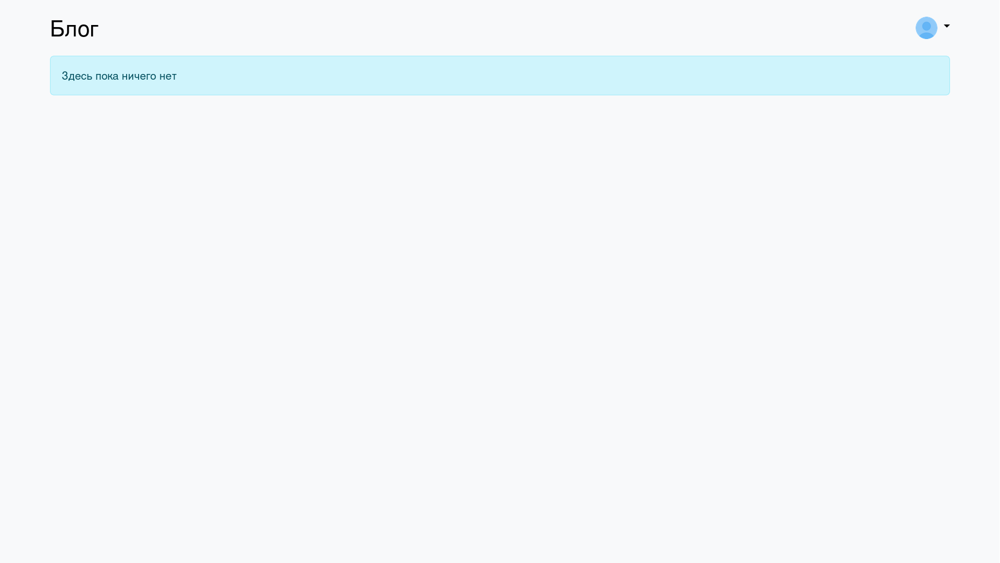
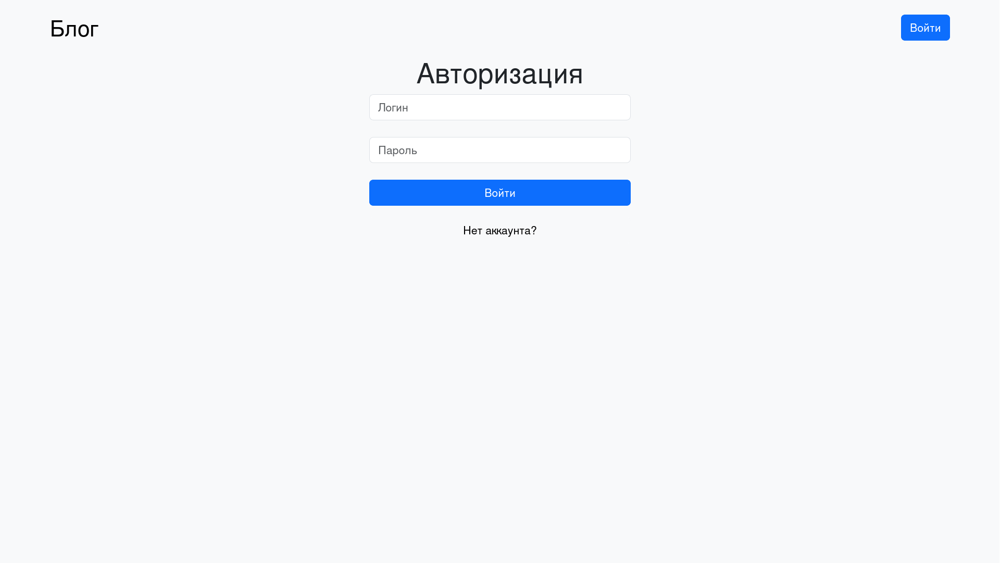
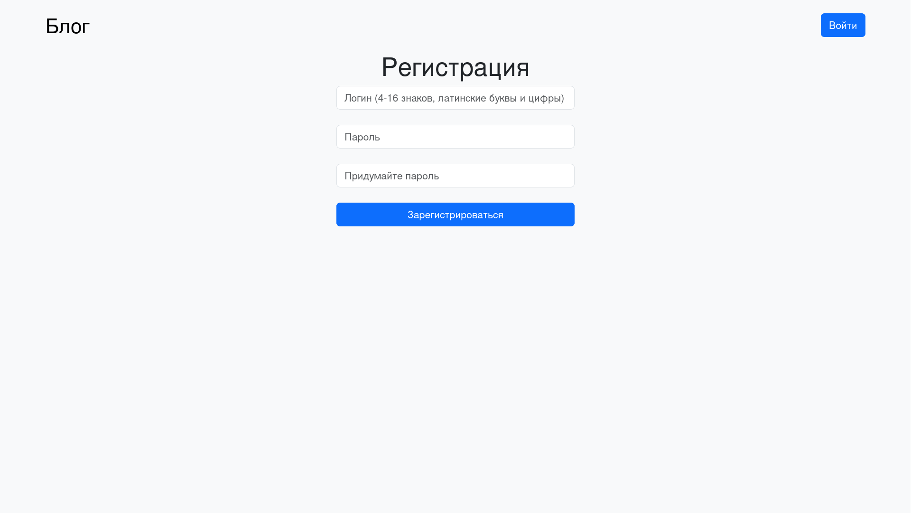
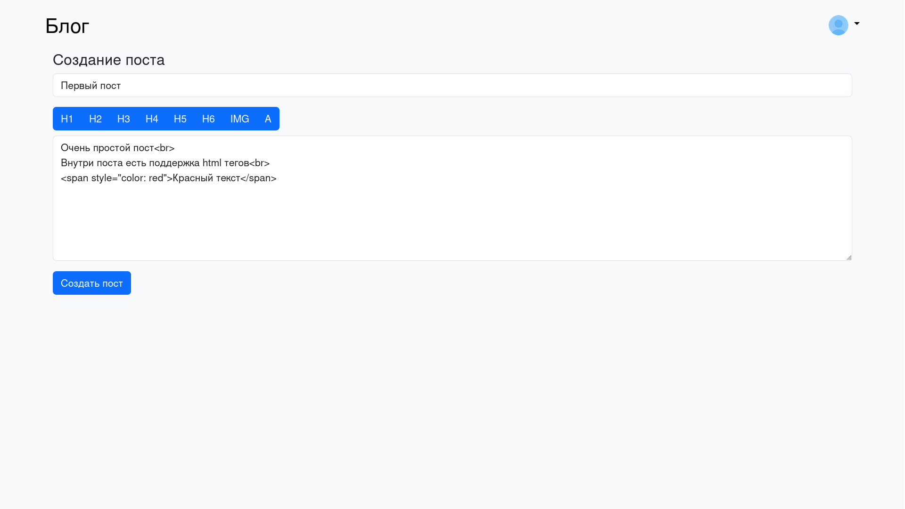
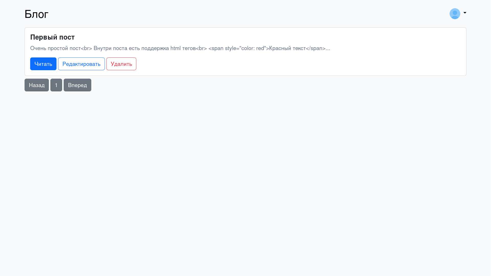
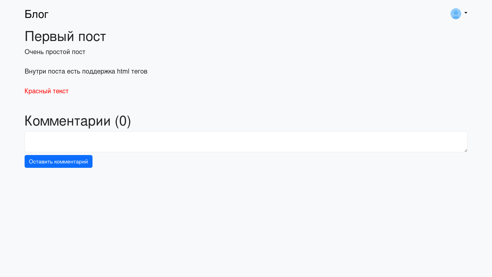
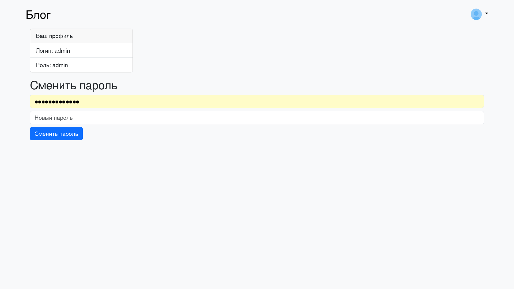

# Блог-платформа на Flask

## Запуск проекта
1. Загрузить репозиторий через git clone
2. Синхронизировать через uv sync
3. Запустить через uv run main.py

Если не установлен uv, библиотеки можно установить вручную через pip (Windows) или pip3 (Linux, macOS).<br>
```shell
# Windows
pip install flask
pip install sqlalchemy

# Linux / Mac OS
pip3 install flask
pip3 install sqlalchemy
```

## Скриншоты
### Главная страница (без постов)


### Вход в аккаунт


### Создание аккаунта


### Новый пост


### Главная страница


### Пост


### Профиль


